# Auditoría de tablas — gestorrutas

> Inventario completo del esquema a fecha 2026-04-15 (post migración global a español).
> BD: `gestorrutas` en `127.0.0.1:3308` (MySQL 8.4).
> 27 tablas, ~40 500 filas totales, 37 FKs.

> **Estado migración**: todas las tablas, FKs y la mayoría de los campos de negocio están en español. Las FKs siguen el patrón `id_<tabla>` (p.ej. `id_cliente`, `id_ruta`). Los timestamps son `creado_en` / `actualizado_en`. Se mantienen en inglés los campos técnicos (unidades `_kg`, `_m3`, `_min`, `_pct`, `_km`, `x`, `y`), de contrato externo (`api_*` GLS) y financieros (`cost_per_km`, `price_multiplier`, `gls_fuel_pct_current`, `cost_*`, `gls_*` en historial/lineas).

---

## 1. Mapa por dominio

| Dominio | Tablas |
|---|---|
| **Maestras** | `clientes`, `vehiculos`, `delegaciones`, `comerciales`, `rutas`, `usuarios` |
| **Operación diaria** | `pedidos`, `pedido_lineas`, `hojas_ruta`, `hoja_ruta_lineas`, `horarios_cliente` |
| **Planificación/optimizador** | `planes_ruta`, `paradas_ruta`, `plantillas_ruta`, `paradas_plantilla_ruta` |
| **Paquetería/GLS** | `transportistas`, `tarifas_transportista`, `zonas_transportista`, `recargos_transportista`, `config_envios_gls` |
| **Relaciones N:M** | `cliente_rutas`, `usuario_comerciales` |
| **Caches** | `cache_distancias` |
| **Histórico/analítica** | `historial_coste_cliente` |
| **Sistema** | `config_app`, `log_auditoria`, `migraciones_schema` |

---

## 2. Diagrama de relaciones (FKs)

```mermaid
erDiagram
    DELEGACIONES ||--o{ CLIENTES : ubica
    DELEGACIONES ||--o{ VEHICULOS : asigna
    DELEGACIONES ||--o{ PLANES_RUTA : parte
    DELEGACIONES ||--o{ PLANTILLAS_RUTA : parte
    COMERCIALES ||--o{ CLIENTES : atiende
    COMERCIALES ||--o{ PEDIDOS : toma
    COMERCIALES ||--o{ HOJA_RUTA_LINEAS : atiende
    COMERCIALES ||--o{ USUARIOS : es
    COMERCIALES ||--o{ USUARIO_COMERCIALES : mapea
    RUTAS ||--o{ CLIENTES : principal
    RUTAS ||--o{ CLIENTE_RUTAS : NxM
    RUTAS ||--o{ HOJAS_RUTA : planifica
    CLIENTES ||--o{ HORARIOS_CLIENTE : tiene
    CLIENTES ||--o{ CLIENTE_RUTAS : pertenece
    CLIENTES ||--o{ PEDIDOS : genera
    CLIENTES ||--o{ HOJA_RUTA_LINEAS : recibe
    CLIENTES ||--o{ PARADAS_RUTA : parada
    CLIENTES ||--o{ PARADAS_PLANTILLA_RUTA : parada
    CLIENTES ||--o{ HISTORIAL_COSTE_CLIENTE : historial
    PEDIDOS ||--o{ PEDIDO_LINEAS : contiene
    PEDIDOS ||--o{ HOJA_RUTA_LINEAS : entrega
    PEDIDOS ||--o{ PARADAS_RUTA : entrega
    VEHICULOS ||--o{ HOJAS_RUTA : realiza
    VEHICULOS ||--o{ PLANES_RUTA : realiza
    VEHICULOS ||--o{ PLANTILLAS_RUTA : plantilla
    USUARIOS ||--o{ HOJAS_RUTA : responsable
    USUARIOS ||--o{ USUARIO_COMERCIALES : mapea
    HOJAS_RUTA ||--o{ HOJA_RUTA_LINEAS : compuesta
    HOJAS_RUTA ||--o{ HISTORIAL_COSTE_CLIENTE : origen
    PLANES_RUTA ||--o{ PARADAS_RUTA : compuesto
    PLANTILLAS_RUTA ||--o{ PARADAS_PLANTILLA_RUTA : compuesta
    TRANSPORTISTAS ||--o{ TARIFAS_TRANSPORTISTA : tarifas
    TRANSPORTISTAS ||--o{ ZONAS_TRANSPORTISTA : zonas
    TRANSPORTISTAS ||--o{ RECARGOS_TRANSPORTISTA : recargos
```



> Atributos detallados de cada entidad en la sección 3 (Detalle por tabla). El bloque Mermaid se mantiene minimal solo con relaciones para máxima compatibilidad con renderers.

> Nota: `cache_distancias`, `config_app`, `config_envios_gls`, `log_auditoria` y `migraciones_schema` no tienen FKs declaradas — se muestran como entidades aisladas. `log_auditoria.id_usuario` es FK *lógica* a `usuarios` pero no está restriccionada a nivel de BD (para no perder registros si se borra un usuario).

### Vista alternativa (ASCII, por dominio)

```
┌─────────────── MAESTRAS ───────────────┐
│                                        │
│  delegaciones ──┬── clientes           │
│                 ├── vehiculos          │
│                 └── planes_ruta        │
│                                        │
│  rutas ──── clientes                   │
│    │                                   │
│    └── cliente_rutas (NxM)             │
│                                        │
│  comerciales ──── clientes (×4 FKs)    │
│                   pedidos              │
│                   hoja_ruta_lineas     │
│                   usuarios             │
│                                        │
│  usuarios ──── usuario_comerciales     │
│                                        │
└────────────────────────────────────────┘

┌───────── OPERACIÓN DIARIA ─────────────┐
│                                        │
│  pedidos ──► pedido_lineas             │
│     │                                  │
│     └───► hoja_ruta_lineas             │
│                │                       │
│                ▼                       │
│            hojas_ruta ◄── vehiculos    │
│                            usuarios    │
│                                        │
│  clientes ──► horarios_cliente         │
│                                        │
└────────────────────────────────────────┘

┌───────── PLANIFICACIÓN ────────────────┐
│                                        │
│  planes_ruta ──► paradas_ruta          │
│     │             │                    │
│     │             ├── clientes         │
│     │             └── pedidos          │
│     ├── vehiculos                      │
│     └── delegaciones                   │
│                                        │
│  plantillas_ruta ──► paradas_plantilla │
│     │                │                 │
│     │                └── clientes      │
│     ├── vehiculos                      │
│     └── delegaciones                   │
│                                        │
└────────────────────────────────────────┘

┌───────── GLS / PAQUETERÍA ─────────────┐
│                                        │
│  transportistas ──┬── tarifas_transp.  │
│                   ├── zonas_transp.    │
│                   └── recargos_transp. │
│                                        │
│  config_envios_gls (singleton)         │
│                                        │
└────────────────────────────────────────┘

┌───────── HISTÓRICO ────────────────────┐
│                                        │
│  historial_coste_cliente               │
│    ├── clientes                        │
│    └── hojas_ruta                      │
│                                        │
└────────────────────────────────────────┘

┌───────── CACHE / SINGLETONS / SISTEMA ──┐
│                                         │
│  cache_distancias      (cache OSRM)     │
│  config_app            (k/v app)        │
│  config_envios_gls     (singleton GLS)  │
│  log_auditoria         (audit trail)    │
│  migraciones_schema    (registro migr.) │
│                                         │
│  [ sin FKs — tablas autocontenidas ]    │
│                                         │
└─────────────────────────────────────────┘
```

**Inventario completo (27 tablas):**

| # | Tabla | Filas aprox | Dominio | Tiene relaciones |
|---|---|---:|---|---|
| 1 | `clientes` | 4 006 | Maestras | ✅ |
| 2 | `vehiculos` | 126 | Maestras | ✅ |
| 3 | `delegaciones` | 4 | Maestras | ✅ |
| 4 | `comerciales` | 59 | Maestras | ✅ |
| 5 | `rutas` | 21 | Maestras | ✅ |
| 6 | `usuarios` | 4 | Maestras | ✅ |
| 7 | `pedidos` | 21 | Operación | ✅ |
| 8 | `pedido_lineas` | 8 | Operación | ✅ |
| 9 | `hojas_ruta` | 13 | Operación | ✅ |
| 10 | `hoja_ruta_lineas` | 220 | Operación | ✅ |
| 11 | `horarios_cliente` | 19 392 | Operación | ✅ |
| 12 | `cliente_rutas` | 670 | N:M | ✅ |
| 13 | `usuario_comerciales` | 16 | N:M | ✅ |
| 14 | `planes_ruta` | 0 | Planificación | ✅ |
| 15 | `paradas_ruta` | 0 | Planificación | ✅ |
| 16 | `plantillas_ruta` | 0 | Planificación | ✅ |
| 17 | `paradas_plantilla_ruta` | 0 | Planificación | ✅ |
| 18 | `transportistas` | 1 | GLS | ✅ |
| 19 | `tarifas_transportista` | 123 | GLS | ✅ |
| 20 | `zonas_transportista` | 35 | GLS | ✅ |
| 21 | `recargos_transportista` | 12 | GLS | ✅ |
| 22 | `config_envios_gls` | 1 | GLS | ❌ (singleton) |
| 23 | `historial_coste_cliente` | 34 | Analítica | ✅ |
| 24 | `cache_distancias` | 15 708 | Cache | ❌ |
| 25 | `config_app` | 5 | Sistema | ❌ (k/v) |
| 26 | `log_auditoria` | 0 | Sistema | ❌ (FK lógica no-constraint) |
| 27 | `migraciones_schema` | 30 | Sistema | ❌ |

---

## 3. Detalle por tabla

Leyenda estado: 🟢 en uso intensivo · 🟡 en uso ligero · ⚪ definida pero sin datos · 🔴 candidata a eliminar

---

### 🟢 `clientes` — 4 006 filas
Maestro de clientes (tiendas/floristerías). Núcleo del negocio.

**PK:** `id` (int unsigned, auto_increment)
**Columnas:** `id`, `nombre`, `direccion`, `codigo_postal`, `telefono`, `notas`, `activo`, `id_comercial`, `id_comercial_planta`, `id_comercial_flor`, `id_comercial_accesorio`, `al_contado`, `id_ruta`, `id_delegacion`, `x`, `y`, `hora_apertura`, `hora_cierre`, `hora_apertura_2`, `hora_cierre_2`, `creado_en`, `actualizado_en`.

**Relaciones salientes:** `id_delegacion` → `delegaciones`, `id_ruta` → `rutas`, 4× `id_comercial_*` → `comerciales`.
**Relaciones entrantes:** `horarios_cliente`, `cliente_rutas`, `pedidos`, `hoja_ruta_lineas`, `paradas_ruta`, `paradas_plantilla_ruta`, `historial_coste_cliente`.

**Observaciones:** cobertura de CPs ~95 % (ver CLAUDE.md §8). Las 4 columnas de comercial modelan que un cliente puede tener representantes distintos según categoría de producto.

---

### 🟢 `vehiculos` — 126 filas
Flota propia.

**PK:** `id` (int unsigned, auto_increment)
**Columnas:** `id`, `nombre`, `matricula`, `id_delegacion`, `max_weight_kg`, `max_volume_m3`, `max_items`, `cost_per_km`, `activo`, `creado_en`, `actualizado_en`.

**Relaciones salientes:** `id_delegacion` → `delegaciones`.
**Relaciones entrantes:** `hojas_ruta`, `planes_ruta`, `plantillas_ruta`.

**Observaciones:** `cost_per_km` inicializado por categoría vía `seed_vehicle_cost_per_km.sql`. Es variable financiera — auditable por `log_auditoria` (acción `update_vehicle_cost`). No reintroducir bug de UPDATE parcial (ver CLAUDE.md §4.5).

---

### 🟢 `delegaciones` — 4 filas
Centros logísticos propios (depósitos desde donde salen las rutas).

**PK:** `id` (int unsigned, auto_increment)
**Columnas:** `id`, `nombre`, `direccion`, `telefono`, `notas`, `x`, `y`, `hora_apertura`, `hora_cierre`, `activo`, `creado_en`, `actualizado_en`.
**Relaciones entrantes:** `clientes`, `vehiculos`, `planes_ruta`, `plantillas_ruta`.

---

### 🟢 `comerciales` — 59 filas
Catálogo de comerciales/representantes.

**PK:** `id` (int unsigned, auto_increment)
**Columnas:** `id`, `codigo`, `nombre`, `creado_en`.
**Relaciones entrantes:** 4 columnas en `clientes`, `pedidos`, `hoja_ruta_lineas`, `usuarios`, `usuario_comerciales`.

---

### 🟢 `rutas` — 21 filas
Agrupación lógica de clientes en una zona de reparto (no es una ruta-de-GPS; es la "ruta comercial").

**PK:** `id` (int, auto_increment)
**Columnas:** `id`, `nombre`, `color`, `activo`, `creado_en`, `actualizado_en`.
**Relaciones entrantes:** `clientes.id_ruta`, `cliente_rutas`, `hojas_ruta`.

---

### 🟢 `usuarios` — 4 filas
Usuarios de la app con autenticación.

**PK:** `id` (int unsigned, auto_increment) · **UNIQUE:** `username`
**Columnas:** `id`, `username`, `hash_password`, `nombre_completo`, `rol` (`comercial`/`logistica`/`admin`), `id_comercial`, lockout (`intentos_fallidos`, `bloqueado`, `bloqueado_en`), metadata login (`ultimo_login_en`, `ultimo_login_ip`, `ultimo_intento_fallido`), `activo`, `creado_en`, `actualizado_en`.

**Relaciones salientes:** `id_comercial` → `comerciales`.
**Relaciones entrantes:** `hojas_ruta.id_usuario`, `usuario_comerciales`.

---

### 🟢 `pedidos` — 21 filas
Cabecera de pedido (un cliente, una fecha).

**PK:** `id` (int unsigned, auto_increment)
**Columnas:** `id`, `id_cliente`, `id_comercial`, `fecha_pedido`, `notas`, `cc_aprox`, `observaciones`, `estado` (`pendiente`/`confirmado`/`anulado`), `creado_en`, `actualizado_en`.
**Relaciones entrantes:** `pedido_lineas`, `hoja_ruta_lineas`, `paradas_ruta`.

---

### 🟢 `pedido_lineas` — 8 filas
Líneas de pedido (ítems).

**PK:** `id` (int unsigned, auto_increment)
**Columnas:** `id`, `id_pedido`, `nombre_producto`, `cantidad`, `weight_kg`, `volume_m3`, `unload_time_min`.
**Nota:** `nombre_producto` es texto libre (catálogo `productos` eliminado en migración previa).

---

### 🟢 `hojas_ruta` — 13 filas
Hoja de ruta (entregas del día — cabecera).

**PK:** `id` (int, auto_increment)
**Columnas:** `id`, `id_ruta`, `id_vehiculo`, `id_usuario`, `fecha`, `responsable`, `estado` (`borrador`/`cerrada`/`en_reparto`/`completada`), agregados (`total_cc`, `total_carros`, `total_cajas`, `total_bn`, `total_litros`), `notas`, `creado_en`, `actualizado_en`.

---

### 🟢 `hoja_ruta_lineas` — 220 filas
Líneas de la hoja de ruta (una parada = un cliente).

**PK:** `id` (int, auto_increment)
**Columnas clave:** `id_hoja_ruta`, `id_pedido`, `id_cliente`, `id_comercial`, `zona`, `carros`, `cajas`, `cc_aprox`, `orden_descarga`, campos GLS (`detour_km`, `cost_own_route`, `cost_gls_raw`, `cost_gls_adjusted`, `gls_recommendation`, `gls_service`, `gls_notes`), `observaciones`, `estado` (`pendiente`/`entregado`/`cancelado`/`no_entregado`), `creado_en`.

**Observaciones:** tabla central del cálculo de coste marginal (ver `services/RouteCostCalculator.php`). Los campos `cost_*` y `gls_*` se mantienen en inglés por ser financieros / contrato externo GLS.

---

### 🟢 `horarios_cliente` — 19 392 filas
Horarios de apertura por día de la semana (la apertura "principal" vive en `clientes.hora_apertura/hora_cierre` para fallback; esta tabla guarda el detalle semanal extraído vía `scripts/google_hours.py`).

**PK:** `id` (int, auto_increment)
**Columnas:** `id`, `id_cliente`, `dia_semana`, `hora_apertura`, `hora_cierre`.

---

### 🟢 `cliente_rutas` — 670 filas
N:M entre `clientes` y `rutas` (un cliente puede pertenecer a varias rutas lógicas).

**PK:** `id` (int, auto_increment)
**Columnas:** `id`, `id_cliente`, `id_ruta`, `created_at` (no migrado — tabla puente menor).

---

### 🟢 `usuario_comerciales` — 16 filas
N:M entre `usuarios` y `comerciales` (para usuarios tipo `comercial` que gestionan más de un código comercial).

**PK:** `id` (int, auto_increment)
**Columnas:** `id`, `id_usuario`, `id_comercial`.

---

### 🟢 `historial_coste_cliente` — 34 filas
Fotografía periódica del coste por cliente para analítica histórica.

**PK:** `id` (int, auto_increment)
**Columnas clave:** `id_cliente`, `id_hoja_ruta`, `id_plan_ruta`, `fecha`, `carros`, `cajas`, `weight_kg`, `num_parcels`, `detour_km`, `vehicle_cost_per_km`, `cost_own_route`, `cost_gls_raw`, `cost_gls_adjusted`, `price_multiplier_used`, `recommendation` (`own_route`/`externalize`/`break_even`/`unavailable`), `savings_if_externalized`, `gls_service`, `notes`, `calculated_at`.

**Uso:** gráficas de evolución "¿a este cliente nos sale más barato externalizarlo?" en el dashboard. Campos analíticos (`cost_*`, `weight_kg`, `recommendation`, `savings_if_externalized`, `notes`, `calculated_at`) se mantienen en inglés por ser técnicos / financieros.

---

### 🟢 `cache_distancias` — 15 708 filas
Cache de respuestas OSRM (distancia y duración entre pares de coordenadas).

**PK:** `id` (int, auto_increment) · **INDEX:** `(origin_lat)`, `(creado_en)`
**Columnas:** `id`, `origin_lat`/`origin_lng`, `dest_lat`/`dest_lng`, `distance_km`, `duration_s`, `creado_en`.

**Observaciones:** se puede truncar sin riesgo (se repoblará llamando al router). Crece rápido — vigilar tamaño. Campos lat/lng/_km/_s mantenidos en inglés (técnicos).

---

### 🟢 `transportistas` — 1 fila (solo GLS)
Maestro de transportistas externos (paquetería).

**PK:** `id` (int, auto_increment) · **UNIQUE:** `nombre`
**Columnas:** `id`, `nombre`, `activo`, `divisor_vol`, `fuel_pct`, `creado_en`, `actualizado_en`.

**Observaciones:** diseñada para múltiples transportistas pero hoy solo hay GLS. `fuel_pct` mantenido en inglés (convención _pct).

---

### 🟢 `tarifas_transportista` — 123 filas
Tarifa escalonada por zona y franja de peso.

**PK:** `id` (int, auto_increment)
**Columnas:** `id`, `id_transportista`, `nombre_servicio`, `tipo_tarifa`, `zona`, `peso_min`, `peso_max`, `precio_base`, `vigencia_desde`, `vigencia_hasta`, `creado_en`, `actualizado_en`.

**Seed:** `sql/seed_gls_tariff_2026.sql`. Tarifa GLS 2026 completa.

---

### 🟢 `zonas_transportista` — 35 filas
Mapeo de CP → zona tarifaria.

**PK:** `id` (int, auto_increment)
**Columnas:** `id`, `id_transportista`, `codigo_pais`, `prefijo_cp`, `zona`, `remoto`, `creado_en`, `actualizado_en`.

---

### 🟢 `recargos_transportista` — 12 filas
Recargos aplicables (combustible, CP remoto, etc.).

**PK:** `id` (int, auto_increment)
**Columnas:** `id`, `id_transportista`, `tipo`, `importe`, `porcentaje`, `activo`, `creado_en`, `actualizado_en`.

---

### 🟢 `config_envios_gls` — 1 fila
Singleton de variables GLS.

**PK:** `id` (int unsigned, auto_increment) — siempre `id = 1` (singleton, no constraint formal)
**Columnas clave:** `cp_origen`, `pais_origen`, `price_multiplier` (descuento contractual), `gls_fuel_pct_current` (recargo combustible), `prefijos_cp_remotos` (CSV de CPs remotos), `usar_peso_volumetrico`, `servicio_por_defecto`, pesos/volúmenes por carro/caja (`default_weight_per_*_kg`, `default_parcels_per_*`, `default_volume_per_*_cm3`), API GLS (`api_user`, `api_password`, `api_env`, `api_base_url`), `creado_en`, `actualizado_en`.

**Nota crítica:** `findBestRate()` debe recibir SIEMPRE `price_multiplier` y `fuel_pct_override` (ver CLAUDE.md §4.4). Los campos financieros (`price_multiplier`, `gls_fuel_pct_current`, `default_*_per_*`) y de contrato API (`api_*`) se mantienen en inglés.

---

### 🟢 `config_app` — 5 filas
Singletones generales (clave/valor).

**PK:** `clave` (varchar) — **PK natural, no auto_increment**
**Columnas:** `clave` (PK), `valor`, `descripcion`.

**Contenido actual:**
| clave | valor | descripcion |
|---|---|---|
| `base_unload_min` | 5 | Tiempo base descarga por parada |
| `default_speed_kmh` | 50 | Velocidad fallback Haversine |
| `lunch_duration_min` | 60 | Duración almuerzo |
| `lunch_earliest` | 12:00 | Hora mínima inicio almuerzo |
| `lunch_latest` | 15:30 | Hora máxima inicio almuerzo |

---

### 🟢 `migraciones_schema` — 30 filas
Registro de migraciones aplicadas.

**PK:** `filename` (varchar) — **PK natural, no auto_increment**
**Columnas:** `filename` (PK), `applied_at`.

---

### 🟡 `log_auditoria` — 0 filas
Log de auditoría para cambios sensibles.

**PK:** `id` (int unsigned, auto_increment) · **INDEX:** `(accion)`, `(entidad)`, `(creado_en)`
**Columnas:** `id_usuario`, `username`, `accion`, `entidad`, `id_entidad`, `valor_anterior` (JSON), `valor_nuevo` (JSON), `ip`, `creado_en`.

**Estado:** estructura y modelo operativos (`models/AuditLog.php`). Invocado solo en 3 puntos: actualizaciones de tarifa GLS (`GlsCostController` ×2) y coste de vehículo (`VehicleController` ×1). Si quieres trazabilidad de más eventos, hay que añadir más `AuditLog::log(...)`.

---

### ⚪ `planes_ruta` — 0 filas
Plan de ruta generado por el optimizador (`services/RouteOptimizer.php`).

**PK:** `id` (int, auto_increment)
**Columnas:** `id`, `plan_date`, `id_vehiculo`, `id_delegacion`, `total_distance_km`, `total_time_h`, `total_unload_min`, `status` (`draft`/`confirmed`/`in_progress`/`completed`), `created_at` (no migrado — tabla sin uso productivo).

**Estado:** modelo `RoutePlan` tiene método `save()` que inserta en esta tabla y en `paradas_ruta`. Nadie lo llama desde la UI en producción — el optimizador hoy se usa "en caliente" (calcula y devuelve JSON sin persistir). Tabla preparada para futuro feature "guardar plan diario".

---

### ⚪ `paradas_ruta` — 0 filas
Paradas dentro de un plan de ruta.

**PK:** `id` (int, auto_increment)
**Columnas:** `id`, `id_plan_ruta`, `stop_order`, `id_cliente`, `id_pedido`, `estimated_arrival`, `estimated_unload_min`, `status` (`pending`/`arrived`/`completed`/`skipped`).

**Estado:** igual que `planes_ruta` (vinculadas).

---

### ⚪ `plantillas_ruta` — 0 filas
Plantillas de ruta (rutas recurrentes por día de la semana).

**PK:** `id` (int, auto_increment)
**Columnas:** `id`, `name`, `day_of_week`, `id_vehiculo`, `id_delegacion`, `created_at` (campos `name`/`day_of_week`/`created_at` no migrados — tabla sin uso productivo).

**Estado:** modelo `RouteTemplate` y `TemplateController` existen. Endpoints `api/templates/*` registrados en `index.php`. No hay datos → feature no activada por los usuarios.

---

### ⚪ `paradas_plantilla_ruta` — 0 filas
Paradas dentro de una plantilla de ruta.

**PK:** `id` (int, auto_increment)
**Columnas:** `id`, `id_plantilla`, `stop_order`, `id_cliente`.

**Estado:** vinculada a `plantillas_ruta`.

---

### ~~`productos`~~ — **ELIMINADA 2026-04-15**
Catálogo maestro de productos. Eliminada junto con `pedido_lineas.id_producto` (ver `sql/migration_drop_productos.sql`). La app contabiliza bultos/cajas, no líneas de catálogo; `pedido_lineas.nombre_producto` (texto libre) sigue siendo suficiente.

---

## 4. Migraciones aplicadas (timeline)

| Orden | Fecha | Migración |
|---|---|---|
| 1 | 2026-04-14 | `migration_rename_tablas_espanol.sql` (todas las tablas → ES) |
| 2 | 2026-04-15 | `migration_rename_fks_espanol.sql` (FKs `client_id`→`cliente_id`, etc.) |
| 3 | 2026-04-15 | `migration_drop_productos.sql` (eliminar tabla) |
| 4 | 2026-04-15 | `migration_rename_columnas_cache_distancias.sql` (`creado_en`) |
| 5 | 2026-04-15 | `migration_rename_columnas_config_app.sql` (`clave/valor/descripcion`) |
| 6 | 2026-04-15 | `migration_rename_columnas_log_auditoria.sql` (`accion/entidad/...`) |
| 7 | 2026-04-15 | `migration_rename_columnas_gls_lote2.sql` (transportistas/tarifas/zonas/recargos/config GLS) |
| 8 | 2026-04-15 | `migration_rename_columnas_comerciales.sql` (`codigo/nombre`) |
| 9 | 2026-04-15 | `migration_rename_columnas_rutas.sql` (`nombre/activo/timestamps`) |
| 10 | 2026-04-15 | `migration_rename_columnas_delegaciones.sql` (`nombre/direccion/...`) |
| 11 | 2026-04-15 | `migration_rename_columnas_vehiculos.sql` (`nombre/matricula/activo`) |
| 12 | 2026-04-15 | `migration_rename_columnas_horarios_cliente.sql` (`dia_semana/hora_*`) |
| 13 | 2026-04-15 | `migration_rename_columnas_pedidos.sql` (`fecha_pedido/notas`) |
| 14 | 2026-04-15 | `migration_rename_columnas_pedido_lineas.sql` (`nombre_producto/cantidad`) |
| 15 | 2026-04-15 | `migration_rename_columnas_hojas_ruta.sql` (timestamps) |
| 16 | 2026-04-15 | `migration_rename_columnas_hoja_ruta_lineas.sql` (`creado_en`) |
| 17 | 2026-04-15 | `migration_rename_columnas_usuarios.sql` (`nombre_completo/rol/...`) |
| 18 | 2026-04-15 | `migration_rename_columnas_clientes.sql` (`nombre/direccion/...`) |
| 19 | 2026-04-15 | `migration_invertir_ids.sql` (39 columnas FK `*_id`→`id_*`) |

---

## 5. Candidatas a revisar

| Tabla | Motivo | Acción sugerida |
|---|---|---|
| `planes_ruta` + `paradas_ruta` | 0 filas, modelo implementado pero nadie guarda | Mantener si el plan es activar "guardar ruta del día"; si no, eliminar |
| `plantillas_ruta` + `paradas_plantilla_ruta` | 0 filas, feature expuesta en API pero no usada | Validar con el usuario si la feature tiene sentido. Pendiente migrar `name`/`day_of_week`/`created_at` si se usa |
| `log_auditoria` | 0 filas | Ampliar cobertura (auditar más acciones) o aceptar que solo cubre GLS/vehículos |
| `cache_distancias` | 15 708 filas, crece rápido | Implementar política de expiración (borrar entradas > 3 meses) |
| `cliente_rutas` | `created_at` no migrado | Renombrar a `creado_en` por consistencia (low-priority) |

---

## 6. Convenciones finales

### 6.1 Lo que SÍ está en español
- **Nombres de tabla**: todas (`clientes`, `vehiculos`, `pedidos`, `transportistas`...).
- **FKs**: patrón `id_<tabla>` (`id_cliente`, `id_ruta`, `id_vehiculo`, `id_comercial`, `id_delegacion`, `id_hoja_ruta`, `id_plan_ruta`, `id_pedido`, `id_usuario`, `id_plantilla`, `id_transportista`, `id_entidad`, `id_comercial_planta/flor/accesorio`).
- **Campos de negocio**: `nombre`, `direccion`, `codigo_postal`, `telefono`, `notas`, `activo`, `matricula`, `codigo`, `rol`, `nombre_completo`, `hash_password`, `bloqueado`, `intentos_fallidos`, `ultimo_login_*`, `creado_en`, `actualizado_en`, `fecha_pedido`, `nombre_producto`, `cantidad`, `dia_semana`, `hora_apertura/cierre`, `nombre_servicio`, `tipo_tarifa`, `codigo_pais`, `prefijo_cp`, `cp_origen`, `pais_origen`, `prefijos_cp_remotos`, `usar_peso_volumetrico`, `servicio_por_defecto`, `clave`, `valor`, `descripcion`, `accion`, `entidad`, `valor_anterior/nuevo`.

### 6.2 Lo que se mantiene en inglés (intencional)
- **Identificadores técnicos universales**: `id`, `username`, `email`, `ip`, `x`, `y`.
- **Unidades en sufijos**: `*_kg`, `*_m3`, `*_min`, `*_pct`, `*_km`, `*_s`, `*_cm3`.
- **Coordenadas y geocoding**: `lat`, `lng`, `origin_*`, `dest_*`.
- **Variables financieras**: `cost_per_km`, `price_multiplier`, `gls_fuel_pct_current`, `cost_own_route`, `cost_gls_raw`, `cost_gls_adjusted`, `savings_if_externalized`, `vehicle_cost_per_km`, `precio_base`.
- **Contrato externo GLS**: `api_user`, `api_password`, `api_env`, `api_base_url`, `default_weight_per_carro_kg`, `default_weight_per_caja_kg`, `default_parcels_per_*`, `default_volume_per_*_cm3`, `divisor_vol`, `fuel_pct`.
- **Campos analíticos del historial**: `recommendation`, `gls_recommendation`, `gls_service`, `gls_notes`, `num_parcels`, `weight_kg`, `calculated_at`, `notes` (en `historial_coste_cliente`).
- **Campos no migrados** (tablas sin uso productivo): `plantillas_ruta.name/day_of_week/created_at`, `planes_ruta.created_at`, `paradas_ruta.estimated_arrival/estimated_unload_min/status`, `paradas_plantilla_ruta.stop_order`, `cliente_rutas.created_at`.

### 6.3 Estrategia de adaptación del código
La migración fue **coherente sin compat layer**: tras `migration_invertir_ids.sql`, se hizo replace global PHP+JS+Python para usar `id_<tabla>` en todas las capas. El JSON API también devuelve los nombres en español. No hay aliases `AS xxx_id` redundantes en SELECTs.

Excepción: `scripts/informe_rutas.py` mantiene alias compat (`c.nombre AS name`, `c.id_delegacion AS delegacion_id`) para no propagar cambios al resto del script.

---

## 7. Observaciones generales

1. **Coherencia ES end-to-end:** BD ↔ PHP ↔ JS ↔ HTML ↔ Python usan los mismos nombres de columna y FK. Los JSON enviados al frontend reflejan los nombres en español.

2. **FKs robustas:** 37 FKs definidas; la mayoría con `ON DELETE` implícito (RESTRICT). Al borrar un cliente o un vehículo con datos asociados, fallará — comportamiento intencionado.

3. **Singletons mal modelados:** `config_envios_gls` tiene 1 fila pero sin constraint único. Se confía en que siempre haya 1. Similar en `transportistas` (1 fila = GLS).

4. **Tabla `comerciales` sobre-indexada en `clientes`:** 4 FKs distintos a la misma tabla (principal, planta, flor, accesorio). Modelo flexible pero complica queries — `models/Client.php` tiene helper `commercialIdsFromClient()` para consolidar.

5. **Separación de aperturas:** `clientes.hora_apertura` (fallback) vs `horarios_cliente` (detalle semanal). Duplicación intencionada para simplicidad pero requiere mantener coherencia.

6. **Test suite:** `tests/test_route_cost_calculator.php` pasa 22/22 tras la migración global.
